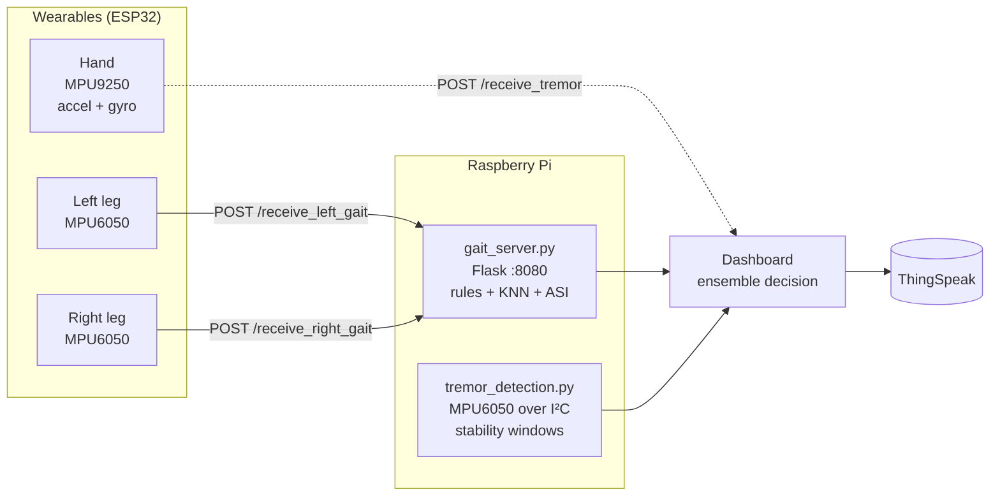
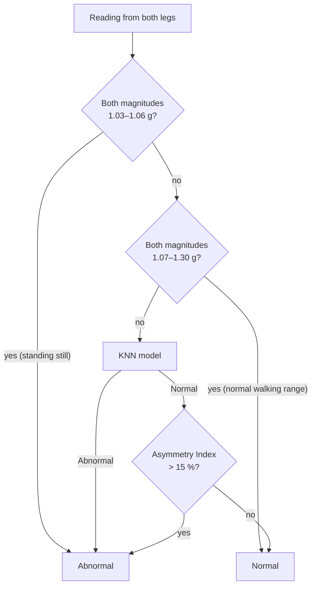

<p align="center">
  
</p>

📄 **Accepted at IEEE TENCON 2026** — the paper describing this system has been accepted at the IEEE Region 10 Conference (TENCON) 2026.


<p align="center">
  <a href="LICENSE"></a>
  <a href="https://github.com/raheebnn/TremoGait/actions/workflows/ci.yml"></a>
  
  
  
  
  <a href="https://github.com/raheebnn/TremoGait/stargazers"></a>
</p>

<p align="center">
  <b>Wearable ESP32 sensors on the hand and both legs stream motion data to a Raspberry Pi,<br/>where machine-learning models screen for Parkinson's-related tremor and gait abnormalities.</b>
</p>

<p align="center">
  <a href="#-how-it-works">How it works</a> •
  <a href="#-results">Results</a> •
  <a href="#-quick-start">Quick start</a> •
  <a href="docs/API.md">API</a> •
  <a href="docs/HARDWARE.md">Hardware</a> •
  <a href="#-limitations--roadmap">Roadmap</a>
</p>


> [!WARNING]
> **Not a medical device.** TremoGait is an academic prototype for research and education. It must not be used to diagnose or rule out any condition. Anyone with health concerns should see a qualified neurologist.

---

## ✨ Highlights

- **Two complementary signals** — hand tremor (accelerometer + gyroscope) and bilateral gait (left and right leg acceleration).
- **Low-cost wearables** — three ESP32 boards with MPU9250 / MPU6050 IMUs, streaming over Wi-Fi.
- **Hybrid decision logic** — physical rules (stationary / normal-range checks) first, a KNN model for ambiguous strides, then an **Asymmetry Index** check between legs.
- **Robust session result** — majority vote over 10 strides instead of trusting any single reading.
- **Ensemble screening** — tremor and gait results are combined into one of three outcomes.
- **Live monitoring** — real-time sensor plots on the Pi and optional upload to ThingSpeak.

---

## 🧠 How it works



### Gait pipeline (per stride)



After **10 strides**, a majority vote gives the session result. The Asymmetry Index is `|L − R| / ((L + R) / 2) × 100` using the acceleration magnitude of each leg.

### Tremor pipeline

- **Features:** `aX, aY, aZ, gX, gY, gZ`
- **Model:** SVM (RBF kernel) + `StandardScaler`, trained in `notebooks/tremor_model_training.ipynb`.
- **Live detection:** `tremor_detection.py` reads an MPU6050 on the Pi, applies calibration offsets, plots the signals, and every ~20 s labels the window *stable* or *tremor detected* based on how many samples exceed the stability limits.

### Final decision

| Tremor | Gait | Screening outcome |
|---|---|---|
| Abnormal | Abnormal | Strong indication of Parkinson's-related symptoms — see a neurologist |
| Abnormal | Normal | Early signs detected |
| Normal | Abnormal | Early signs detected |
| Normal | Normal | No symptoms detected |

---

## 📊 Results

Numbers come from the training notebooks.

### Tremor (80 / 20 stratified split)

| Model | Train acc. | Test acc. |
|---|---|---|
| Logistic Regression | 0.768 | 0.758 |
| Random Forest | 1.000 | 0.998 |
| **SVM (RBF)** — *deployed* | 0.977 | **0.982** |

<p align="center">
  
  
</p>

### Gait (dataset balanced by gender × status)

| Model | Test acc. |
|---|---|
| Random Forest | 0.882 |
| **KNN** — *deployed* | **0.846** |
| XGBoost | 0.825 |
| Logistic Regression / Naive Bayes | ~0.57 |

<p align="center">
  
  
</p>

> [!NOTE]
> These are **row-level random splits**, so readings from the same person can appear in both train and test sets. Random Forest's 100 % train accuracy also points to overfitting. A fair estimate needs a **subject-wise split** (test on people the model has never seen).

---

## 📁 Repository structure

```text
TremoGait/
├── firmware/
│   ├── hand_tremor/hand_tremor.ino   # ESP32 + MPU9250 → JSON POST every 500 ms
│   └── leg_gait/leg_gait.ino         # ESP32 + MPU6050 → form POST every 1 s (set LEG)
├── raspberry_pi/
│   ├── gait_server.py                # Flask server: rules + KNN + ASI, 10-stride vote
│   └── tremor_detection.py           # Live MPU6050 plots + tremor windows
├── dashboard/
│   └── ensemble_and_thingspeak.py    # Ensemble decision + ThingSpeak upload (snippets)
├── notebooks/
│   ├── tremor_model_training.ipynb
│   └── gait_model_training.ipynb
├── docs/
│   ├── API.md                        # Server endpoints + curl examples
│   ├── HARDWARE.md                   # Parts list and wiring
│   └── figures/                      # Plots exported from the notebooks
├── models/                           # Trained .pkl files go here (git-ignored)
├── data/                             # Datasets go here (git-ignored)
├── assets/                           # Banner + social preview
└── requirements.txt
```

---

## 🚀 Quick start

### 1. Clone and install

```bash
git clone https://github.com/raheebnn/TremoGait.git
cd TremoGait
python -m venv .venv
source .venv/bin/activate        # Windows: .venv\Scripts\activate
pip install -r requirements.txt
```

### 2. Train the models

Put your datasets in `data/` (column formats in [`data/README.md`](data/README.md)), update the file paths at the top of each notebook, and run all cells. Copy the exported models into `models/`:

- `svm_model_with_scaler.pkl` — tremor
- `knn_model_with_scaler.pkl` → rename to `knn_model_with_scaler22.pkl` — gait

### 3. Flash the ESP32s

Install the Arduino libraries **MPU6050** (Electronic Cats / I2Cdevlib) and **MPU9250_asukiaaa**, then in each sketch set:

```cpp
const char* ssid     = "YOUR_WIFI_SSID";
const char* password = "YOUR_WIFI_PASSWORD";
// and replace YOUR_SERVER_IP with the Pi's IP address
```

For the legs, flash `leg_gait.ino` twice — once with `#define LEG "left"` and once with `#define LEG "right"`.

### 4. Run on the Raspberry Pi

```bash
# Gait server — prompts for gender, or set it up front:
TREMOGAIT_GENDER=m python raspberry_pi/gait_server.py

# Live tremor detection (needs an MPU6050 wired to the Pi)
python raspberry_pi/tremor_detection.py
```

Check the server with `curl http://<pi-ip>:8080/health`, then start walking. Results appear in the console and at `GET /result` — see [`docs/API.md`](docs/API.md).

### 5. ThingSpeak (optional)

```bash
export THINGSPEAK_API_KEY="your_write_key"   # never commit this
```

---

## ⚙️ Configuration

| Variable | Used by | Default |
|---|---|---|
| `TREMOGAIT_GENDER` | `gait_server.py` | prompt at startup (`m` / `f`) |
| `TREMOGAIT_GAIT_MODEL` | `gait_server.py` | `models/knn_model_with_scaler22.pkl` |
| `TREMOGAIT_TREMOR_MODEL` | `tremor_detection.py` | `models/svm_model_with_scaler.pkl` |
| `THINGSPEAK_API_KEY` | dashboard | empty |

Gait thresholds (stationary range, normal range, `ASI_THRESHOLD`, `PREDICTION_THRESHOLD`) and tremor limits (`STABLE_LIMIT_ACCEL`, `STABLE_LIMIT_GYRO`, `CALIB_OFFSETS`) are constants at the top of each script.

---

## 🗺️ Limitations & roadmap

- [ ] **Tremor server endpoint** — `hand_tremor.ino` posts to `/receive_tremor`, which isn't implemented yet.
- [ ] **Use the SVM live** — `tremor_detection.py` loads the SVM but currently decides with stability thresholds only.
- [ ] **Full dashboard app** — `dashboard/` holds snippets, not a runnable app.
- [ ] **Multi-user sessions** — the gait server keeps global state, so it handles one person at a time.
- [ ] **Subject-wise evaluation** and a larger, more diverse dataset.
- [ ] **Frequency features** (e.g. 4–6 Hz tremor band power) instead of raw samples.

---

## 🤝 Contributing

[Issues](https://github.com/raheebnn/TremoGait/issues) and pull requests are welcome — see [`CONTRIBUTING.md`](CONTRIBUTING.md).

## 📄 License

[MIT](LICENSE). Datasets you use may have their own terms.

## 👤 Author

**Raheeb Bin Nazmul** · [@raheebnn](https://github.com/raheebnn)
Electrical & Electronic Engineering, North South University

If this project is useful to you, please ⭐ the repo or cite it with [`CITATION.cff`](CITATION.cff).
